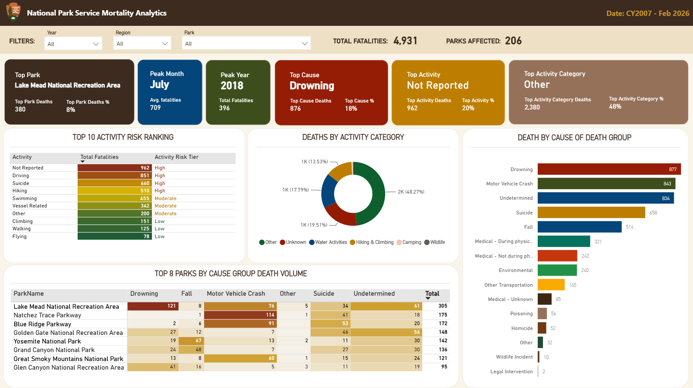
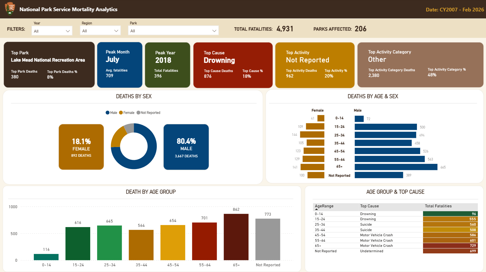
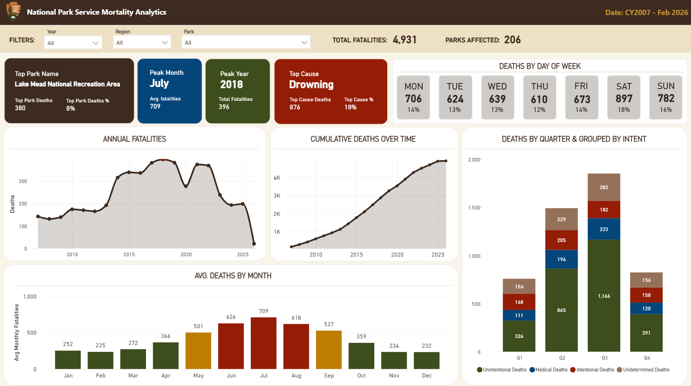

# National Park Service — Mortality Analytics Dashboard

## Overview

This Power BI dashboard analyzes visitor fatality data across US National Parks
from 2007 through February 2026, covering 4,931 deaths across 206 parks.

The analysis surfaces mortality patterns by demographics, cause of death, activity
type, time trends, and geographic concentration — giving a comprehensive picture
of where, when, and how fatal incidents occur within the National Park system.

## Questions Explored

- Which parks have the highest fatality rates, and what causes drive them?
- How do age, sex, and activity type correlate with cause of death?
- What seasonal and day-of-week patterns emerge in park fatalities?
- How has annual mortality trended over nearly two decades, and what explains
  the peak in 2018?
- Which activities carry the highest risk, and how do they rank by intent
  (unintentional vs. intentional vs. undetermined)?

## Dashboard Pages

### Demographics
Breaks down fatalities by sex (80.4% male), age group, and the intersection of
both. Includes an age-group-to-top-cause table revealing that drowning dominates
younger age groups while motor vehicle crashes are the leading cause for visitors
45 and older.

### Trends
Shows annual fatalities over time, cumulative deaths, average deaths by month
(peak: July at 709), deaths by day of week (Saturday highest at 897), and
quarterly breakdowns grouped by intent.

### Causes of Death
Ranks causes of death (drowning: 877, motor vehicle crash: 843, undetermined: 834),
maps activities to risk tiers, and identifies the top 8 parks by cause-group
death volume. Lake Mead National Recreation Area leads with 380 total deaths.

## Data Model

Built on NPS incident/mortality records spanning CY2007–Feb 2026. Key dimensions:

- **Date** — year, month, quarter, day of week
- **Location** — park name, region
- **Decedent** — age range, sex
- **Incident** — cause of death, cause group, activity, activity category, intent

## Tools Used

- **Power BI Desktop** — data model, DAX measures, report design
- **DAX** — custom measures for fatality counts, rankings, rolling totals,
  and risk tier classification

## How to Use This File

1. Download `report/NPS_Mortality_Analytics.pbix`
2. Open in Power BI Desktop (free download from Microsoft)
3. Use the Year, Region, and Park slicers to filter the full dataset
4. Navigate between the Demographics, Trends, and Causes of Death report pages

## Dashboard Preview

### Demographics

### Temporal Trends

### Causes of Death

## About

Built to explore public safety patterns in the US National Park system using
official NPS mortality data.

[LinkedIn](#) | [Portfolio](#)
